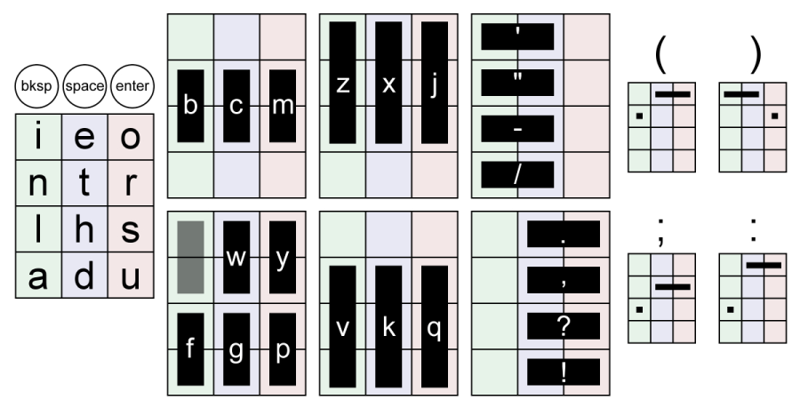

# linewriter
A simple [Twiddler](http://twiddler.tekgear.com/) chord map optimized for typing narrative prose, based off of concepts from [Typemax](https://forum.tekgear.com/t/typemax-a-config-optimized-for-typing-without-mcc/417) and [Cool Hand](https://forum.tekgear.com/t/cool-hand-a-beginner-friendly-chord-map/335).

Requires firmware 15+

# layout

